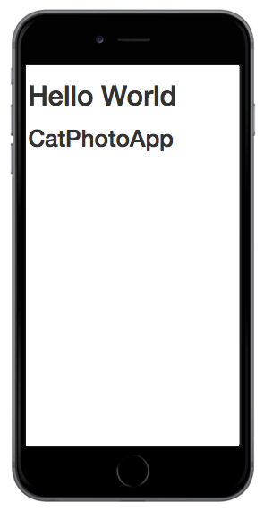

# 100 Days Of Code - Log

### Day 1: January 1, 2018 

**Today's Progress**: Worked on freeCodeCamp. I thought it was better to start off from the very beginning.

Forgot to make the commit to the git repository for this log.

**Thoughts:** I already know the basics of this and part of me just wants to skip to the fun stuff. I need to take those thoughts and move past that. A strong foundation is really what I'd like to have.

**Link to work:** [Link of main repository](https://github.com/mandaris/100-days-of-code)

### Day 2: January 2, 2018 

**Today's Progress**: Worked more with freeCodeCamp. I'm enjoying the little lessons in that it allows me to make small spurts of progress. That feeling of moving forward with every step.

**Thoughts:** I enoy getting off of my high horse and just learning how to do stuff. I'm going to take these lessons and use it to make my website and myself better.

**Link to work:** [Link of main repository](https://github.com/mandaris/100-days-of-code)
